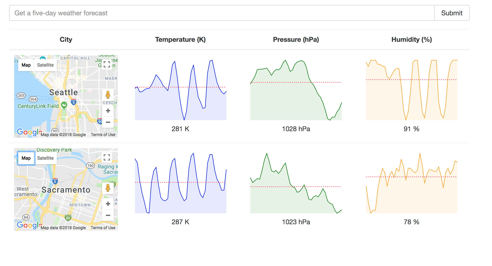

# Weather App
Simple React/Redux project to fetch and view US cities' temperatures, humidity and pressure using the [Open Weather Map API](https://openweathermap.org/api)

## Getting Started

These instructions will give you a local copy on your machine which you can then run and use. These steps assumes you have npm installed already. If you don't, here is the [installation guide](https://docs.npmjs.com/getting-started/installing-node) to get started.

```
git clone https://github.com/mariesta/weatherApp.git
npm install
npm start
```

Look for the line 'Project is running at [localhost url]'. When you submit a city name, you should see something like this.



You can then search cities as much as you want. Enjoy!

## Acknowledgments

* [Modern React with Redux course](https://www.udemy.com/react-redux/learn/v4/overview)